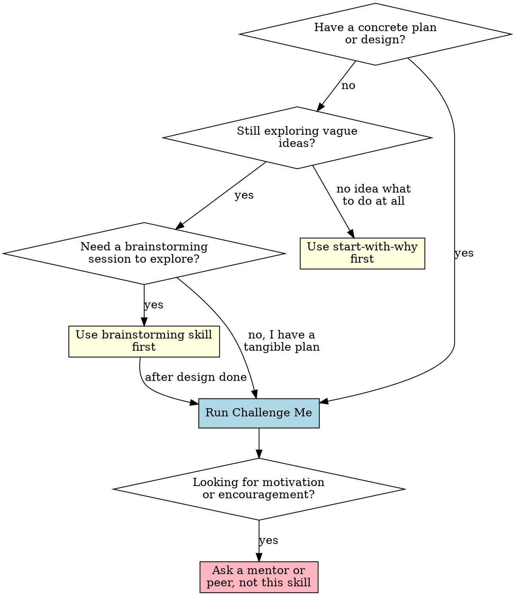

# Challenge Me — Battle-Test Your Business Idea

## Overview

**Every business plan is a set of assumptions waiting to break.**

You have a plan. You believe in it. That's exactly why you need someone to attack it — before the market does. This skill systematically stress-tests a venture, product, or strategy by surfacing hidden assumptions, blind spots, and wishful thinking.

**When to use this (and when not to):**

---

## The Challenge Framework

Challenge every plan through **six lenses**. Each lens answers a different question:

| Lens | Question | Why It Matters |
|------|----------|----------------|
| **Pre-Mortem** | Why did we fail? | Avoids overconfidence bias |
| **Assumptions** | What must be true? | Finds the weakest link |
| **Competition** | What happens after we win? | Competitive response kills naive plans |
| **Economics** | Does the math work? | The market doesn't care about your costs |
| **Customer** | Are they real? | Politeness ≠ demand |
| **Execution** | Can this team deliver? | Ideas are cheap, execution is everything |

---

## The Six Lenses

### 1. Pre-Mortem — "It's 2 Years Later. We Failed. Why?"

Imagine you fast-forward 24 months. The venture has failed completely — not a soft landing, but a spectacular crash. Write the obituary.

**Prompts to use:**
- What specific decision killed us?
- Which assumption turned out to be catastrophically wrong?
- What did competitors do that we didn't see coming?
- Where did we run out of money and why?
- What did customers say when asked why they left?
- Which early signal did we ignore?

> **Why it works:** The pre-mortem (Klein, 2007) neutralizes overconfidence. Once you've imagined failure, you're wired to prevent it.

### 2. Assumption Assault — "What Must Be True for This to Work?"

Every business plan is built on assumptions. Most are wrong. Your job is to find which ones.

**Assumption tiers:**

| Tier | Question | Example |
|------|----------|---------|
| **L1: Market** | Does the market actually exist? | "SMBs in Brazil need X" — do they? Will they pay? |
| **L2: Product** | Can we build this? | "We can deliver feature Y in 3 months" — based on what? |
| **L3: Distribution** | How do customers find us? | "They'll come if we build it" — worst assumption in startups |
| **L4: Pricing** | Will they pay this much? | "We'll charge $50/mo" — what is this based on? |
| **L5: Timing** | Is now the right time? | "Market is ready" — or are you too early / too late? |

**Challenge loop:**
1. Ask: "What must be true for this plan to work?"
2. List every assumption (don't filter yet)
3. Rank by: **how wrong would this kill us?** × **how uncertain are we?**
4. Pick the top 3 → design the cheapest test for each

### 3. Competitive Response — "You Win. Now What?"

Most competitive analysis is naive. It assumes competitors stand still. They don't.

**Scenarios to challenge:**
- **They copy you:** Competitor clones your key feature in 3 months. What now?
- **They undercut you:** Your biggest rival drops price to zero. What happens?
- **They lock up supply:** Supplier exclusive / talent acquisition / patent blitz. Do you have alternatives?
- **They acquire your channel:** Platform dependency dies (e.g., iOS changes privacy rules). Are you exposed?
- **They ignore you:** Actually the worst signal — means the market is too small to matter.

> **Rule of thumb:** If you can't name 3 ways a competitor could kill you within 12 months, you haven't thought hard enough.

> Need the full competitive sweep — visible, invisible, adjacent, future competitors? That's **dark-forest**'s territory; this lens is the entry check.

### 4. Economic Scrutiny — "Does the Unit Math Work?"

| Metric | Challenge Question | Red Flag |
|--------|-------------------|----------|
| **Unit Economics** | What is the real CAC vs LTV? | LTV:CAC < 3, especially B2B with long sales cycles |
| **Gross Margin** | Can you make money after COGS? | < 60% for SaaS, < 30% for physical goods |
| **Break-even** | When do you stop burning cash? | Breakeven after runway — math doesn't close |
| **Scaling Costs** | Do per-unit costs stay flat? | U-shaped curve (support, infra, sales complexity) |
| **CAC Payback** | How long to recover customer acquisition? | > 12 months needs really strong retention |

**Model the worst case, not the base case.** If the worst case still works, you have a business. If the base case barely works, you don't.

### 5. Customer Reality — "Are They Real or Are You Hoping?"

**Hard questions:**
- Have you actually sold to *anyone*? (Not "they said they'd buy" — actual money.)
- Would they feel *very disappointed* without you? (Sean Ellis test — <40% means no PMF.)
- Are you confusing *interest* with *commitment*? The Mom Test: polite head-nodding is not validation.
- What's the switching cost? If they already solve this problem, why switch?
- Who is the real decision-maker? Builder sells to user, but user needs budget approval — plan fails.

> **The Mom Test rule:** If you haven't felt the awkward silence that follows "Would you pay for this?" — you haven't tested.

### 6. Execution Gap — "Why Can *You* Do This?"

**Team challenges:**
- What's missing from the team that kills the venture if not fixed in 6 months?
- Which founder skill is over-indexed? (Two technical founders who can't sell. Two sales founders who can't build.)
- What happens when the founding team hits its first existential conflict? Do you have decision-making protocols?
- Are you solving for *time* (brute force will win) or *insight* (you know something others don't)? If time — do you have enough runway?

---

## Running the Session

### One-Breath Challenge (Quick, 5-10 min)

When you need a fast sanity check:

1. State your plan in 1 sentence
2. Answer:
   - What's the single assumption that kills us if wrong?
   - Who would feel "very disappointed" without us? (Name at least 3 real people)
   - How does the first competitor copy us, and what's our response?
   - What does the unit math look like in the worst case?
3. If any answer is "I don't know" — that's your homework.

### Deep Dive Challenge (Full, 30-60 min)

For serious plans before committing resources:

1. **Pre-Mortem** (10 min) — Write the failure story
2. **Assumption Map** (10 min) — Tier 1-5, rank + test plan
3. **Competitive Battle** (10 min) — Simulate 4 competitor moves
4. **Economic Model** (10 min) — Worst-case unit math
5. **Customer Audit** (10 min) — Real signals vs. wishful thinking
6. **Execution Check** (10 min) — Team gaps + decision protocols
7. **Refine** (10 min) — Challenge → refine, not abandon. Take the top 3 weakest points and turn each into: the cheapest test that would confirm it, and what changes in the plan if confirmed. This is your next action.

**Output:** A challenge report — 3-5 specific weakest points, prioritized by "will kill us if wrong" × "how uncertain we are" — each with a cheapest test and the plan change it triggers:

> | # | Weakest point (lens) | Why it kills us | Cheapest test | If true, plan changes to |
> |---|---|---|---|---|
> | 1 | … | … | … | … |

---

## Red Flags — When the Challenge Exposes Danger

| Red Flag | What It Means | Action |
|----------|---------------|--------|
| Can't name 10 real target customers | No market exists | Do customer discovery before building |
| "We'll figure out monetization later" | No business model | Business model canvas first |
| Unit math requires magic growth | Wishful economics | Model worst case, not base case |
| Competitors are "too dumb to matter" | You're dismissing real threats | Play out their best move |
| "We have no competitors" | No market (or you didn't look) | The only way to have no competitors is to have no market |
| "We've done this before so it will work" | Survivorship bias | Past ≠ future; re-validate assumptions |
| Funding is the plan | Dependency risk | Can you get to revenue without funding? |
| "We just need to hire X" | Execution gap | What if you can't hire X? |

---

## Common Mistakes

- ❌ **Challenging too early** — Don't challenge a vague idea. Use brainstorming or start-with-why first.
- ❌ **Being polite** — The whole point is to be brutal. Polite challenges are wasted breaths.
- ❌ **Confusing challenge with negativity** — The goal is to make the plan stronger, not to tear it down. Challenge → refine, not challenge → abandon.
- ❌ **Only challenging the product, not the business** — Great product, terrible business model is still failure.
- ❌ **Accepting "we'll figure it out"** — If you can't answer now, you won't magically answer later without a plan.

---

**Sources:** Pre-Mortem (Klein, 2007) · The Mom Test (Fitzpatrick, 2013) · Sean Ellis PMF Survey · Unit Economics: SaaS Metrics (Skok, For Entrepreneurs)
