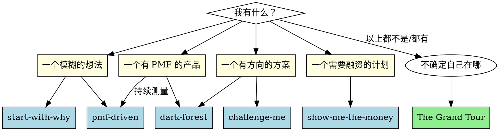

# The Grand Tour — 商业设计全案

## Overview

**创业不是一场冲刺，是一场没有地图的远征。**

你会遇到无数决策：做什么、为什么做、怎么做、什么时候放弃、什么时候坚持。没有任何单一技能或框架能覆盖全程。但有一组**永恒的范式**——每次你回到它们，都会有新的理解。

这就是 The Grand Tour：一套全景地图，串联创业路上的每个关键节点。它不回答"你现在该做什么"——而是告诉你"你现在在哪儿，有哪些工具可以用，前方有什么等着你"。

```
                     ┌─── 认知与定位 ───┐
                     │  Why → PMF → Challenge │
                     │  → Fundraise           │
                     │                        │
    ┌────────────────┤    (知道做什么)        ├────────────────┐
    │                └────────────────────────┘                │
    │                                                          │
    ▼                                                          ▼
┌────── 战略与模式 ──────┐                        ┌────── 执行与增长 ──────┐
│  Dark Forest           │                        │  Know-How             │
│  Business Model        │                        │  增长黑客             │
│  财务预测             │                        │  Laws of Marketing    │
│                        │                        │  Laws of Branding     │
│  (知道在哪竞争)       │                        │  (知道怎么做到)      │
└────────────────────────┘                        └────────────────────────┘
```

> **图例**：**加粗** = 本仓库已实装技能；*斜体* = 工具箱内嵌框架（见 The Toolbox）；未标记者（Know-How、增长黑客、财务预测、Laws of Marketing / Branding…）= 🚧 规划中，尚未实装。

---

## The Journey: 创业四阶段

### Phase 0: 模糊 → 清晰

**核心问题：** "我该做什么？"

| 你的状态 | 使用什么 | 得到什么 |
|----------|----------|----------|
| 有一个模糊的想法，想不清楚 | **start-with-why** | 使命、Golden Circle、Celery Test |
| 想验证这个方向有没有市场 | **pmf-driven** | PMF 假设 + 测量 + 迭代循环 |
| 有了初步方案，想压力测试 | **challenge-me** | Pre-mortem + 假设清单 + 竞争预案 |

**里程碑：** 你能用一句话说清楚"谁需要什么、为什么我、为什么现在"。

### Phase 1: 找 PMF (Product-Market Fit)

**核心问题：** "有没有人真的需要这个？"

| 你的状态 | 使用什么 | 得到什么 |
|----------|----------|----------|
| 不知道谁是真客户 | **pmf-driven** | HXC 定义 + Sean Ellis 测量 |
| 客户说的话不确定真假 | *The Mom Test* (见工具箱) | 信号 vs 噪音的辨别能力 |
| 做了几个版本没人用 | **challenge-me** | 假设哪里错了？是市场还是方案？ |

**里程碑：** ≥ 40% 用户说"没有你会非常失望" + 留存曲线变平。

### Phase 2: 找 Fit + 起步扩张

**核心问题：** "怎么高效增长？"

| 你的状态 | 使用什么 | 得到什么 |
|----------|----------|----------|
| 有了 PMF，怎么快速长大 | **dark-forest** | 谁可能抄你 + 怎么建护城河 |
| 需要融资加速 | **show-me-the-money** | 模拟路演 + 投资人应对策略 |
| 竞争对手出现 | **dark-forest** | 四层竞品扫描 + 防御策略 |
| 怎么定价/定位 | *Business Model Canvas* (见工具箱) | 商业模式全貌 |

**里程碑：** 找到可复制的增长引擎 + 完成机构融资。

### Phase 3: 规模化

**核心问题：** "怎么建一家能长久的公司？"

| 你的状态 | 使用什么 | 得到什么 |
|----------|----------|----------|
| 团队变大，决策变慢 | 🚧 *Know-How* | 系统 vs 流程 vs 文化（规划中） |
| 品牌怎么建 | 🚧 *Laws of Branding* | 定位、品类、心智（规划中） |
| 增长到顶了 | *Second Curve* (见工具箱) | 什么时候应该开第二曲线 |
| 面临大厂竞争 | **dark-forest** (护城河) | 7 Powers 防御诊断 |

**里程碑：** 可持续增长 + 组织能力 > 创始人个人能力。

---

## The Toolbox: 创始人的核心框架库

这里整理了这个项目之外、每个创始人都应该掌握的经典框架。

### Business Model Canvas (Osterwalder)

创业最强大的"一页纸"工具。比商业计划书有用 100 倍。

```
┌──────────────┬──────────────┬───────────────┬──────────────┬──────────────┐
│ 重要伙伴     │ 关键业务     │ 价值主张      │ 客户关系     │ 客户细分     │
│              │ 关键资源     │               │ 渠道通路     │              │
├──────────────┴──────────────┴───────────────┴──────────────┴──────────────┤
│                               成本结构                                   │
├───────────────────────────────────────────────────────────────────────────┤
│                               收入来源                                   │
└───────────────────────────────────────────────────────────────────────────┘
```

**使用时机：** 任何时候需要把商业模式画清楚。特别适合创业初期和融资前。

### The Mom Test (Fitzpatrick)

如何跟用户聊天，得到真实信号而不是礼貌性点头。

| 原则 | 坏信号 | 好信号 |
|------|--------|--------|
| 不要谈论你的方案 | "这听起来很棒！" | "我现在的解决方式是..." |
| 问过去，不是未来 | "我以后一定会用" | "上个月我花了 20 小时做这个" |
| 要承诺，不要兴趣 | "这个想法很有意思" | "你能给我发个 demo 吗？" |

**使用时机：** 做用户访谈之前必读。永远不要跟用户展示产品后再问"你觉得怎么样"。

### First Principles Thinking

把复杂问题拆解到最基本的真理，再从那里重新构建。

```
传统类比思维:  电动车 ≈ 更好的马车 → 优化马
第一性原理:   交通工具 = 把人从 A 移动到 B → 电动马达 + 电池 + 轮子 → 完全不同的设计
```

**使用时机：** 当行业常识感觉不对、市场分析得出"不可能"的结论、或者在思考颠覆性创新时。

### The Lean Startup Cycle (Ries)

```
 Build ──→ Measure ──→ Learn ──→ (repeat)
   ↑                        │
   └────────────────────────┘
            Pivot or Persevere
```

**核心洞察：** 创业不是执行一个已知计划，而是在不确定性中寻找可行路径。每次循环要尽可能短。

### The Second Curve (Handy)

任何成功的业务都会触及增长天花板。问题不是"会不会"而是"什么时候"。在第一条曲线还在上升时就要开始探索第二条曲线。

```
    成功
     ↑
     │    First Curve     Second Curve
     │       ╱╲              ╱╲
     │      ╱  ╲            ╱  ╲
     │     ╱    ╲    ╱╲    ╱    ╲
     │    ╱      ╲  ╱  ╲  ╱      ╲
     │   ╱        ╲╱    ╲╱        ╲
     │  ╱                  ╲
     └──────────────────────────────→ 时间
          ↑ 启动第二曲线的最佳时机
```

**使用时机：** 核心业务开始看到增速放缓、竞争对手涌入、或增长率不足以支撑公司目标时。

### Inversion (Munger)

**不要想"怎么成功"，想"怎么失败"，然后避免那些事。**

> "告诉我我会死在哪里，我就永远不去那里。" — Charlie Munger

应用到创业：
- 问自己：什么会杀死这家公司？
- 列出来：没钱了、市场不存在、团队内讧、被人抄了
- 对每一项：我们现在在做什么来防止它发生？

**使用时机：** 当你在做战略规划、年度计划、或感觉"一切顺利"需要警惕时。

---

## The Mindsets: 创始人必须修炼的思维方式

| 思维模式 | 核心 | 反面 |
|----------|------|------|
| **第一性原理** | 拆到最底层再重建 | 类比思维、行业惯例 |
| **反脆弱** | 从波动中获益 | 追求稳定、规避风险 |
| **概率思维** | 决策是赌注，想期望值 | 二元思维（要么成要么败） |
| **长期主义** | 做十年后还会增值的事 | 追逐短期风口 |
| **逆向思考** | 别人往东我往西（有逻辑地） | 从众、趋势投资 |
| **非对称风险** | 下行有限，上行无限的下注 | 均等下注、风险回报不对等 |
| **奥卡姆剃刀** | 最简单的解释通常是对的 | 过度复杂化问题 |

---

## The Map: 所有技能的导航

当你不确定该用哪个技能时：



---

## Run the Tour

被调用时的会话协议（HITL）：创始人不确定自己在哪、该用什么技能时用三问定位——不要通读全文后让创始人自己找。

1. **定位** — 问三个问题：
   - 你现在有什么？（模糊的想法 / 有方向的方案 / 有 PMF 的产品 / 需要融资的计划 / 以上都不是）
   - 你最大的瓶颈是什么？（不知道做什么 / 没验证 / 长不大 / 被抄 / 融不到资 / 心气没了）
   - 距离上一个里程碑，你卡在哪一步？
2. **指路** — 对照导航图输出路线卡：
   - **你的位置**：阶段 + 本阶段里程碑（你离下一站还差什么）
   - **首选技能**：若落在 🚧 空白区，明说"这站还没修路"，改用工具箱或心气内容替代
   - **它会给你什么**：一句话（查 Phase 表"得到什么"列）
3. **交付** — 路线卡 + 下一步动作。选项摆给创始人选，不替他决定。

若创始人带着明确状态来（"我想验证市场"），跳过第 1 步直接指路。

---

## Quick Reference

| 当前场景 | 首选技能 | 关键框架 |
|----------|----------|----------|
| 不知道做什么 | start-with-why | Golden Circle, Celery Test |
| 不确定有没有市场 | pmf-driven | Sean Ellis Test, Retention Curve |
| 想压力测试方案 | challenge-me | Pre-Mortem, Assumption Assault |
| 想分析竞争对手 | dark-forest | 四层扫描, 7 Powers, Porter's Five Forces |
| 准备融资 | show-me-the-money | 投资备忘录, VC 画像, Pitch Structure |
| 需要画商业模式 | The Grand Tour | Business Model Canvas |
| 要做用户访谈 | The Grand Tour | The Mom Test |
| 想看得更本质 | The Grand Tour | First Principles, Inversion |
| 需要长期战略 | The Grand Tour | Second Curve, 7 Powers |

---

## The Source: 创业路上的源泉

每个创业者都会经历低谷。这个项目解决方法论的问题，但这里解决**心气**的问题。

### 创业的真相

> **创业就是在没人相信的时候相信自己。**

每一个成功的公司，在某个阶段都被所有人否定过。Airbnb 起步时先后被 7 个投资人拒绝，靠卖“奥巴马 O”麦片盒凑了约 3 万美元，才撑到被 YC 录取；最初几个月每周收入只有 200 美元。后来 Founders Fund 投进来时，据说 Peter Thiel 撂过一句“估值太高，但你们非要投就投吧”——这句未必逐字为真，但方向没错：**好的判断往往在没人相信时就开始下注。**

> **市场不关心你的努力，它只关心你的价值。**

你不会因为"很努力"而成功。你成功是因为你在正确的时间、以正确的方式、解决了正确的问题。公平吗？不公平。但这就是规则。

> **PMF 之前不要做任何不能加速 PMF 的事。**

没有 PMF 的时候融资是浪费生命，PR 是浪费钱，招人是制造麻烦。一切资源都应该集中在找到那 40% 的"非常失望"用户上。

> **创始人最稀缺的资源不是钱，是判断力。**

钱可以融资，判断力只能靠练。每一次决策都是训练机会。越早开始自己做决定、为自己的错误买单，判断力增长越快。

### 当你想放弃的时候

每个创始人至少有一次想放弃。通常在以下时刻：
- 做了 6 个月没有任何人用你的产品
- 关键 co-founder 退出
- 融资被 50 个投资人拒绝
- 比你有钱 100 倍的竞争对手进入你的市场

**这时候回到黑暗森林：** 如果你能活过这个冬天，春天来时森林里会少很多人。

### 当你成功以后

成功带来的最大危险是**过去的成功变成今天的惯性**。

- 卖产品出身的人——做了 CEO 还在管销售细节
- 技术出身的人——公司 100 人了还在自己写代码
- 第一曲线成功——用同样的方法论做第二曲线

**Grand Tour 的最后一课：** 创业是一场进化。你需要不断杀死昨天的自己才能活到明天。

---

> **这个项目是创业路上的源泉。当你迷失方向、失去信心、或者只是需要重新思考时，回到这里。导航会告诉你下一步的路。所有工具、框架、和 wisdom 都在这里等你的新理解。**

---

**Sources:** Business Model Generation — Osterwalder · The Mom Test — Fitzpatrick · The Lean Startup — Ries · The Second Curve — Handy · Poor Charlie's Almanack — Munger · Zero to One — Thiel · The Hard Thing About Hard Things — Horowitz · Antifragile — Taleb · Principles — Dalio
